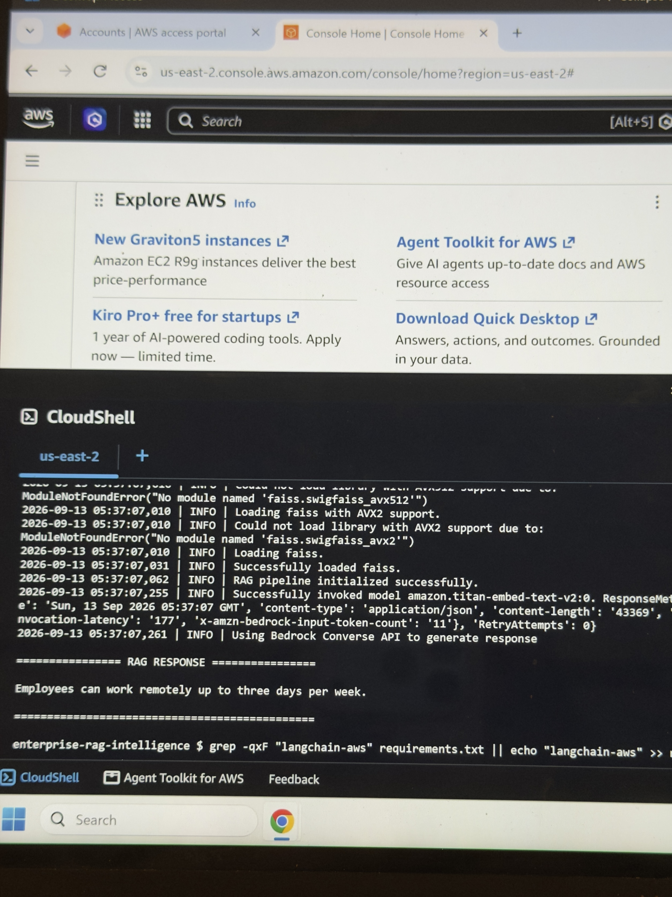

# Enterprise RAG Intelligence

An end-to-end Retrieval-Augmented Generation (RAG) application built with Amazon Bedrock, LangChain, and FAISS.

## Overview

This project demonstrates how enterprise documents can be transformed into searchable knowledge and used by a Large Language Model (LLM) to generate grounded answers.

The pipeline loads documents, splits them into chunks, generates vector embeddings, stores them in FAISS, retrieves relevant context, and sends that context to an Amazon Bedrock model to generate the final response.

## Architecture

Documents → Chunking → Embeddings → FAISS Vector Store → Retriever → Amazon Bedrock LLM → Response

## Technologies

- Python
- Amazon Bedrock
- Amazon Titan Embeddings
- Amazon Nova
- LangChain
- FAISS
- AWS CloudShell

## RAG Pipeline

1. Load enterprise documents
2. Split documents into smaller chunks
3. Generate embeddings using Amazon Titan
4. Store embeddings in FAISS
5. Perform semantic similarity search
6. Retrieve relevant document chunks
7. Send retrieved context to Amazon Bedrock
8. Generate a grounded response

## Project Structure

```text
enterprise-rag-intelligence/
├── data/
├── src/
│   ├── chunking.py
│   ├── config.py
│   ├── document_loader.py
│   ├── embeddings.py
│   ├── llm.py
│   ├── main.py
│   ├── rag_pipeline.py
│   ├── retriever.py
│   └── vector_store.py
├── .env.example
├── .gitignore
├── requirements.txt
└── README.md
```

## Example

Question:

```text
How many days per week can employees work remotely?
```

RAG response:

```text
Employees can work remotely up to three days per week.
```
## RAG Pipeline Output

Below is an example of the RAG pipeline running successfully with Amazon Bedrock:



The answer is generated using context retrieved from the enterprise policy documents.

## Run the Project

Install dependencies:

```bash
pip install -r requirements.txt
```

Run a question through the RAG pipeline:

```bash
python src/main.py --data data --question "How many days per week can employees work remotely?"
```

## Key Features

- End-to-end RAG pipeline
- Semantic document retrieval
- Amazon Bedrock integration
- Amazon Titan embeddings
- FAISS vector search
- Configurable retrieval settings
- Grounded LLM responses
- Modular Python architecture
