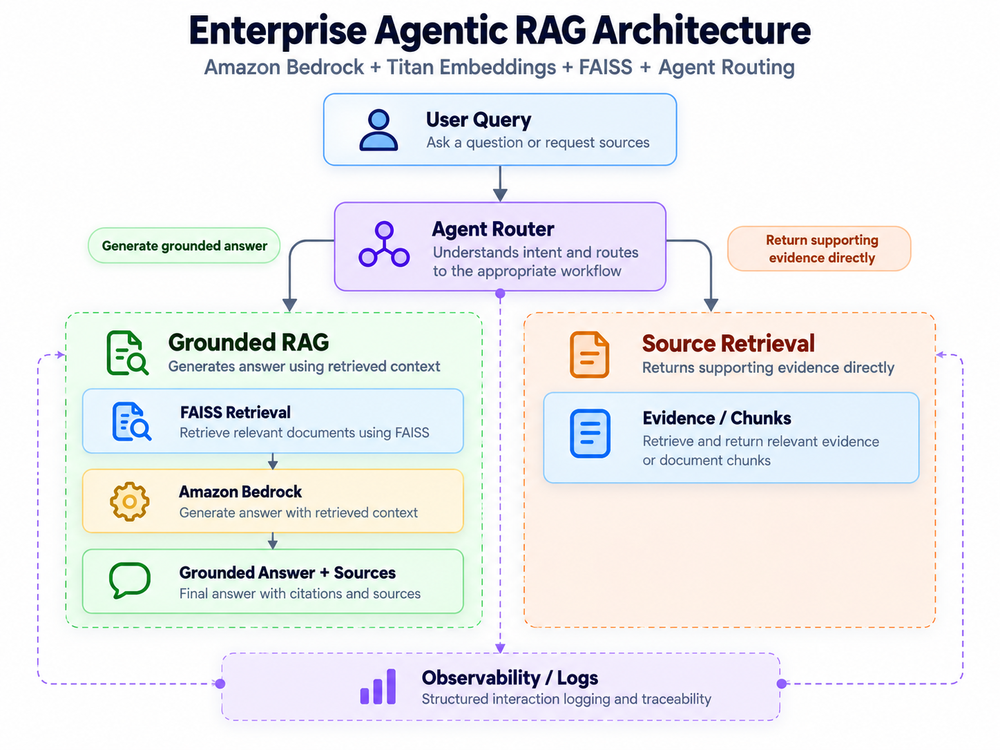

# Enterprise RAG Intelligence

Production-style Agentic RAG system built with Amazon Bedrock, Titan embeddings, FAISS, LangChain, and Python.

## What This Project Demonstrates

- Agentic routing between grounded RAG generation and direct source retrieval
- Amazon Titan embeddings with FAISS semantic search
- Source-grounded answers with traceability
- RAG observability and structured interaction logging
- Retrieval and response evaluation
- Modular enterprise-style GenAI architecture

## Architecture
The following diagram shows the high-level flow of the Enterprise Agentic RAG system. A user query is first analyzed by the agent router, which decides whether to generate a grounded RAG answer or retrieve direct supporting sources.



### Flow Summary
1. **User Query** enters the system
2. **Agent Router** decides the best path based on user intent
3. If the query needs an answer, it goes through **Grounded RAG**
4. **FAISS Retrieval** finds relevant chunks from indexed documents
5. **Amazon Bedrock** generates the grounded response
6. If the user asks for evidence, the system performs **Source Retrieval**
7. The final output returns either a **Grounded Answer + Sources** or **Evidence/Chunks**
## Overview

This project demonstrates how enterprise documents can be transformed into searchable knowledge and used by a Large Language Model (LLM) to generate grounded answers.

The pipeline loads documents, splits them into chunks, generates vector embeddings, stores them in FAISS, retrieves relevant context, and sends that context to an Amazon Bedrock model to generate the final response.

## Technologies

- Python
- Amazon Bedrock
- Amazon Titan Embeddings
- Amazon Nova
- LangChain
- FAISS
- AWS CloudShell

## RAG Pipeline

1. Load enterprise documents
2. Split documents into smaller chunks
3. Generate embeddings using Amazon Titan
4. Store embeddings in FAISS
5. Perform semantic similarity search
6. Retrieve relevant document chunks
7. Send retrieved context to Amazon Bedrock
8. Generate a grounded response

## Project Structure

```text
enterprise-rag-intelligence/
├── data/
├── src/
│   ├── chunking.py
│   ├── config.py
│   ├── document_loader.py
│   ├── embeddings.py
│   ├── llm.py
│   ├── main.py
│   ├── rag_pipeline.py
│   ├── retriever.py
│   └── vector_store.py
├── .env.example
├── .gitignore
├── requirements.txt
└── README.md
```

## Example

Question:

```text
How many days per week can employees work remotely?
```

RAG response:

```text
Employees can work remotely up to three days per week.
```
## RAG Pipeline Output

Below is an example of the RAG pipeline running successfully with Amazon Bedrock:


The answer is generated using context retrieved from the enterprise policy documents.

## Run the Project

Install dependencies:

```bash
pip install -r requirements.txt
```

Run a question through the RAG pipeline:

```bash
python src/main.py --data data --question "How many days per week can employees work remotely?"
```

## Key Features

- End-to-end RAG pipeline
- Semantic document retrieval
- Amazon Bedrock integration
- Amazon Titan embeddings
- FAISS vector search
- Configurable retrieval settings
- Grounded LLM responses
- Modular Python architecture

## Evaluation

The RAG pipeline includes an automated evaluation suite to validate both answer accuracy and source grounding.

Run the evaluation:

```bash
python evaluation/run_evaluation.py

### Evaluation Results

Latest evaluation: **6/6 test cases passed (100%)**

The evaluation validates:
- Answer accuracy against expected responses
- Source grounding against expected documents
- Retrieval and generation performance across the RAG pipeline

## Agentic RAG Architecture

This project implements an enterprise-style Agentic Retrieval-Augmented Generation system using Amazon Bedrock and FAISS.

### Key Capabilities

- Amazon Bedrock for LLM inference and Titan embeddings
- FAISS semantic vector retrieval
- Dynamic agent routing based on user intent
- Grounded RAG answer generation
- Direct source/evidence retrieval
- Source attribution for traceability
- Structured interaction logging and observability
- Evaluation framework for retrieval and response quality
- Modular ingestion, chunking, embeddings, retrieval, and generation layers

## Agent Routing Flow

```text
User Query
    |
    v
Agent Router
    |
    +-------------------------+
    |                         |
    v                         v
Grounded RAG             Source Retrieval
    |                         |
    v                         v
FAISS Retrieval          Evidence/Chunks
    |
    v
Amazon Bedrock
    |
    v
Grounded Answer + Sources
